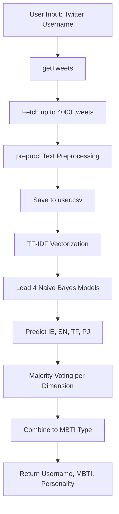

## Architecture Overview

TwiP is a Flask-based web application that analyzes Twitter user personalities using machine learning. The system follows a pipeline architecture where user input flows through data collection, preprocessing, feature extraction, and classification stages.

## Core Components

### 1. Web Application Layer

The Flask application (`application.py`) provides a simple web interface with a single route:

```python
@app.route("/",methods=["GET","POST"])
def home():
    if request.method == 'POST':
        uid = request.form.get("userid")
        name,mbti,personality = classify_user(uid)
        message = "User not found"
        return render_template('analysis.html',display=True,name=name,mbti=mbti,personality=personality)
    return render_template('analysis.html',display=False)
```

The application:
- Accepts Twitter username via POST request
- Delegates processing to `classify_user()` function
- Returns MBTI type and personality description
- Runs on port 8000 with debug mode enabled

### 2. ML Pipeline Layer

The prediction module (`predict.py`) orchestrates the entire classification pipeline:

**Key Responsibilities:**
- Tweet retrieval via Tweepy API
- Text preprocessing and normalization
- Feature extraction using TF-IDF vectorization
- Multi-model prediction using 4 Naive Bayes classifiers
- Result aggregation via majority voting

### 3. Data Storage

The system uses two data directories:

**Pickle_Data/**
- `BNIEFinal.sav` - Introversion/Extroversion classifier
- `BNSNFinal.sav` - Sensing/Intuition classifier
- `BNTFFinal.sav` - Thinking/Feeling classifier
- `BNPJFinal.sav` - Perceiving/Judging classifier

**CSV_Data/**
- `newfrequency300.csv` - Feature vocabulary (300 words)
- `IEFinaltest.csv` - IE dimension training data
- `SNFinaltest.csv` - SN dimension training data
- `TFFinaltest.csv` - TF dimension training data
- `PJFinaltest.csv` - PJ dimension training data

## Data Flow



### Step-by-Step Flow

1. **Input Collection** - User submits Twitter handle via web form
2. **Tweet Retrieval** - System fetches up to 4000 tweets (4 pages × 1000 tweets)
3. **Text Preprocessing** - Each tweet undergoes NLP pipeline (see [NLP Pipeline](/technical/nlp-pipeline))
4. **Feature Extraction** - Preprocessed tweets converted to TF-IDF vectors using 300-word vocabulary
5. **Classification** - Four separate models predict each MBTI dimension
6. **Aggregation** - Most common prediction per dimension determines final type
7. **Result Mapping** - MBTI type mapped to personality description
8. **Response** - User receives personality type and detailed description

## External Dependencies

### Twitter API Integration

The system uses Tweepy with OAuth 1.0a authentication:

```python
auth = tweepy.OAuthHandler(ckey, csecret)
auth.set_access_token(atoken, asecret)
api = tweepy.API(auth)
```

Tweets are fetched using:
```python
tweets = api.user_timeline(
    screen_name=user, 
    count=1000, 
    include_rts=True, 
    page=i
)
```

### Key Libraries

- **Flask** - Web framework
- **Tweepy** - Twitter API client
- **scikit-learn** - ML models and vectorization
- **NLTK** - NLP preprocessing
- **pandas** - Data manipulation
- **pickle** - Model serialization

## Temporary Files

The system creates a temporary `user.csv` file during processing:
- Created when `getTweets()` is called
- Stores preprocessed tweets
- Deleted after classification completes

## Error Handling

The system includes basic error handling:

```python
try:
    # Fetch tweets
except tweepy.TweepError:
    print("Failed to run the command on that user, Skipping...")
```

When a user is not found or tweets cannot be retrieved, processing continues with available data.

## Performance Considerations

- **API Rate Limits**: Twitter API calls may hit rate limits with frequent requests
- **Processing Time**: Fetching 4000 tweets and preprocessing can take 10-30 seconds
- **Model Loading**: Four pickle files loaded on each classification request
- **Memory Usage**: TF-IDF vectorization of thousands of tweets requires significant memory

## Security Notes

**Warning**: The source code contains hardcoded Twitter API credentials (`predict.py:24-27`). In production:
- Move credentials to environment variables
- Use proper secrets management
- Implement rate limiting
- Add input validation
- Sanitize user inputs